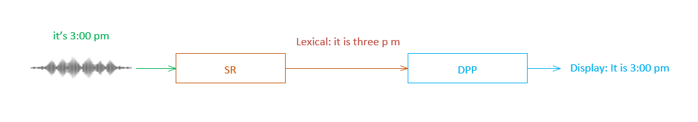
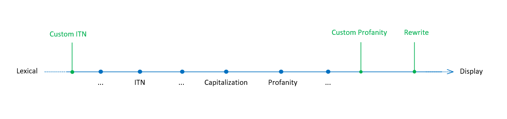

# Concepts

## Display Post Processing (DPP) Overview

Microsoft Speech service can be viewed as two components, speech recognition (SR) and display post processing (DPP). SR service transcripts audio to lexical text, and DPP service transforms the lexical text to display text.



### DPP pipeline and its builders

The DPP service is essential a display post processing pipeline. The display post processing pipeline is composed by a sequence of display format builders. Each builder corresponds to a display format tasks, such as *ITN*, *capitalization*, and *profanity masking/removal*, etc..

*Inverse Text Normalization (ITN)*  

To convert the text of spoken form numbers to display form. For example, 
> `"I spend twenty dollars" -> "I spend $20"`

*Capitalization*  

To upper case entity names, acronyms, or the first letter of a sentence. For example, 
> `"she is from microsoft" -> "She is from Microsoft"`

*Profanity Masking/Removal*  

Masking or removal profanity words from a sentence. For example, assuming "abcd" is a profanity word, then the word will be masked by profanity masking, 

> `"I never say abcd" -> "I never say ****"`

Beside the base builders maintained by Microsoft for the general purpose display processing tasks, the DPP pipeline also provides three customizable builders to meet customers' domain specific requirements.

*Custom ITN*   
Extend the functionalities of base ITN, by applying a rule based custom ITN model from customer.

*Rewrite*  
At the end of pipeline, rewrite one phrase to another based on a rule based model from customer, each rule in the model is a pair of phrases (old -> new).

*Custom Profanity*  
Perform profanity handling based on the profanity word list from customer.

The order of builders in the DPP pipeline is illustrated in below diagram.



### DPP *features*

The term *feature* stands for a behavior of DPP builders. Usually, a DPP builder has a corresponding DPP *feature* which has the same name as the builder, but for profanity builder, it has two features - "profanity masking" and "profanity removal".

DPP service supports turn on/off a *feature* in a speech recognition request.

## What's in Custom DPP?

Custom DPP is a service and a tool set to allow customers to customize certain builders of Microsoft DPP service.

The Custom DPP service provides a set of REST API to create, evaluate, and deploy a Custom DPP model. A Custom DPP model is a collection of the custom models for *Custom ITN*, *Rewrite* and *Custom Profanity*.

For ease of use, Custom DPP also includes a command line utility named Custom DPP CLI. The Custom DPP CLI interacts with Custom DPP service to upload the rules of a custom model, start a model evaluation or model deployment, etc..

In a Custom DPP model, there are three kinds of rules, *ITN*, *Rewrite*, and *Profanity*, which define the corresponding custom models of the three customizable builders, *Custom ITN*, *Rewrite* and *Custom Profanity*.


## Custom ITN

### Pattern-Based Custom ITN

The philosophy of our custom ITN service is that developers can show us the final output they want top see, and our system will figure out how users might say that, and build a model that maps the predicted spoken expressions to the specified output format.

#### Patterns with Literals

For example, a developer may have an item (maybe a product) named with the alphanumeric form "JO:500".  The job of our system will be to figure out that users might say the letter part as "J O", or they might say "joe", and the number part as "five hundred" or "five zero zero" or "five oh oh" or "five double zero", and then build a model that maps all of these possibilities back to "JO:500" (including inserting the colon).

Patterns can be applied in parallenm (put one per line), so a pattern specification file like:

```
JO:500
MM:760
```

can be used to specify multiple itemns.


#### Patterns with Wildcards

Suppose a customer needs to refer to a whole series of alphanumeric items named "JO:500", "JO:600", "JO:700", etc.  We can support this without requiring spelling out all possibilities in several ways.

Character ranges can be specified with the notation `[...]`, so `JO:[5-7]00` is equivalent to writing out three patterns.

There is also a set of wildcard items that can be used.  One of these is \d, which means any digit.  So "JO:\d00" covers "JO:000" ... "JO:999".

Here is a list of supported character classes:

* `\d` - match a digit from '0' to '9', and output it directly
* `\l` - match a letter (case-insensitive) and transduce it to lower case
* `\u` - match a letter (case-insensitive) and transduce it to upper case
* `\a` - match a letter (case-insensitive) and output it directly

There are also "whack escape" expressions for referring to characters that otherwise have special syntactic meaning:

* `\\` - match and output the char '\'
* `\(` and `\)`
* `\{` and `\}`
* `\|`
* `\+` and `\?` and `\*`

### How *Custom ITN* model works?

A *Custom ITN* model is composed by two parts, a mini base ITN model provided by Microsoft, and a custom model built from the custom *ITN* rules.

For a *input string*, 
1. First, the mini base ITN model will transduce the number related phrases in the *input string* to display forms.
2. Then, for the output of the mini base ITN model, the custom model will match and transduce it to the desired format defined by the *ITN* rules of the model. The matching algorithm inside the *Custom ITN* model is case-insensitive.

### Rule syntax

A *Custom ITN* model is built from a set of *ITN* rules. An *ITN* rule is a regular expression like pattern string which describes 

* A matching pattern of the input string
* The desired format of the output string

> Note <br/>
In private preview, Custom ITN only supports on en-us.

#### Input string

The string that a *ITN* rule is trying to match and transduce.

#### Output string

The display format string which is transduced by *ITN* rules from the input string.

#### Atoms in an *ITN* rule

An *ITN* rule is composed of a sequence of atoms. An atom is a single point within the rule which it tries to match and then transduce an input string. There are three kinds of atoms. 

- Matching atom
  
  A literal character or a [character classes](CONCEPTS.md#character-classes) which matches the input string and output it directly without any transduction. It is also called *identity transducer atom*.

- Transducer atom
  
  A transducer that matching a literal character (case-insensitive) or a [character classes](CONCEPTS.md#character-classes) and transduce the input character to the desired one defined by the atom.

- Insert atom
  
  A symbol or punctuation character which insert to the output string directly without any matching.

#### Character classes

Like regular expression, there are several pre-defined character classes for a *ITN* rule:

* `\d` - match a digit from '0' to '9', and output it directly
* `\l` - match a letter (case-insensitive) and transduce it to lower case
* `\u` - match a letter (case-insensitive) and transduce it to upper case
* `\a` - match a letter (case-insensitive) and output it directly
* `\\` - match and output the char '\'

### Examples

#### Group digits

To group 6 digits into 2 groups and add a '-' char between them:

> *ITN* rule: `\d\d\d-\d\d\d` <br/>
Sample: `"cadence one oh five one fifteen" -> "cadence 105-115"`

#### Format a film name

*Space: 1999* is a famous film, to support it:

> *ITN* rule: `Space: 1999` <br/>
Sample: `"watching space nineteen ninety nine" -> "watching Space: 1999"`

#### Format a weapon name

To support the weapon names of AK family:

> *ITN* rule: `AK-\d\d` <br/>
Sample: `"a k forty seven" -> "AK-47"`


## Rewrite

### How *Rewrite* model works?

A *Rewrite* model is a collection of rewrite rules. A rewrite rule is a pair of two phrases `old phrase -> new phrase`. 

General speaking, for an input string, *Rewrite* model will try to replace the `old phrase` in the input string with the corresponding `new phrase` for each rewrite rule.

> Note <br/>
The matching algorithm is case insensitive and uses a greedy policy, so, if two rewrite rules conflict, the one with longer `old phrase` will take effect.

> Note <br/>
The *Rewrite* model supports grammar capitalization, which will capitalize the first letter of a sentence for en-us like locales. It will be turned off if the *Capitalization* feature of DPP is turned off in a speech recognition request.

### Rule syntax

> `old phrase -> new phrase`,  *the ` -> ` stands for TAB character*.

* A rewrite rule is a pair of two phrases, the old phrase and the new phrase. 
* The two phrases are separated by a TAB character. 
* The old phrase will be matched (case-insensitive) and replaced with the new phrase. 

#### Old phrase

The phrase to be matched and replaced. An old phrase is case-insensitive, and [grammar punctuations](#grammar-punctuation) in an old phrase are ignored during match.  

#### New phrase

The phrase to replace the old phrase. A new phrase is case sensitive.

#### Grammar Punctuation

Grammar punctuations are used to separate a sentence or phrase, and clarify how a sentence or phrase should be read.

So, the following punctuations are grammar punctuations if they are followed by space or at the begin or end of a sentence or phrase.

> `. , ? 、 ! : ; ？ 。 ， ¿ ¡ । ؟ ، ` 

However, if the punctuations are in the middle of a word (except a Chinese or Japanese word), they are not grammar punctuations any more. Now, they are just simple characters.

In zh-cn, ja-jp, the above punctuations are always grammar punctuations even if they are between Chinese or Japanese characters, since zh-cn and ja-jp are non-spacing locales.

For example:

* `x, y`: The `','` is a grammar punctuation
* `x.y`: The `'.'` is not a grammar punctuation
* `中.文`: The `'.'` is a grammar punctuation

### Examples

#### Spelling correction

The name 'CVOID-19' sometimes was recognized as 'covered 19', to correct it:

> *Reform* rule: `covered 19	COVID-19`  
Sample: `"covered 19 is a virus" -> "COVID-19 is a virus"`

#### Name capitalization

Gottfried Wilhelm Leibniz was a German mathematician. To make his name displays correctly:

> *Reform* rule: `gottfried leibniz	Gottfried Leibniz`  
Sample: `"gottfried leibniz was a mathematician" -> "Gottfried Leibniz was a mathematician"`


## Custom Profanity

### How *Custom Profanity* model works?

A *Custom Profanity* model acts the same as the base *Profanity* model, except it uses a custom profanity phrase list.

For an input string, 
1. The *Custom Profanity* model will try to match (case insensitive) all the profanity phrases defined in the model.
2. Then, the *Custom Profanity* builder will remove or mask the matched profanity phrases based on the *feature* parameter (*profanityRemoval*/*profanityMasking*) of the speech recognition request.

> Note <br/>
The matching algorithm is case insensitive and uses a greedy policy, so, if two profanity phrases conflict, the longer one will take effect.


### Rule syntax

> `profanity phrase`

* A custom profanity rule is simply a case insensitive phrase.
* The following punctuations are not supported in a profanity phrase.  
`. , ? 、 ! : ; ？ 。 ， ¿ ¡ । ؟ ، ` 

> Note <br/>
In zh-cn and ja-jp, English profanity phrases are not supported. Instead, English profanity word or zh-cn/ja-jp profanity phrase are supported.

### Examples

#### Single profanity word

Assume `xyz` is a profanity word, to add it:

> *Profanity* rule: `xyz`  
Sample: `Turned on profanity masking to mask xyz -> Turned on profanity masking to mask ***`

#### Profanity phrase

Assume `abc lmn` is a profanity phrase, to add it:

> *Profanity* rule: `abc lmn`  
Sample: `Turned on profanity masking to mask abc lmn -> Turned on profanity masking to mask *** ***`
