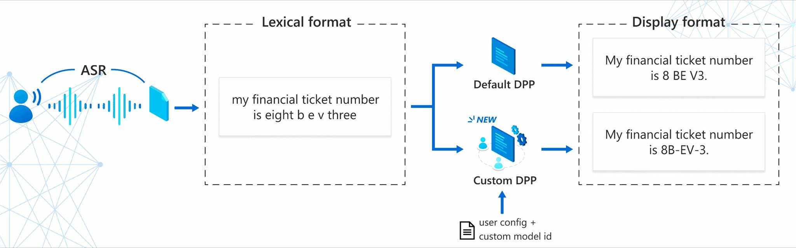
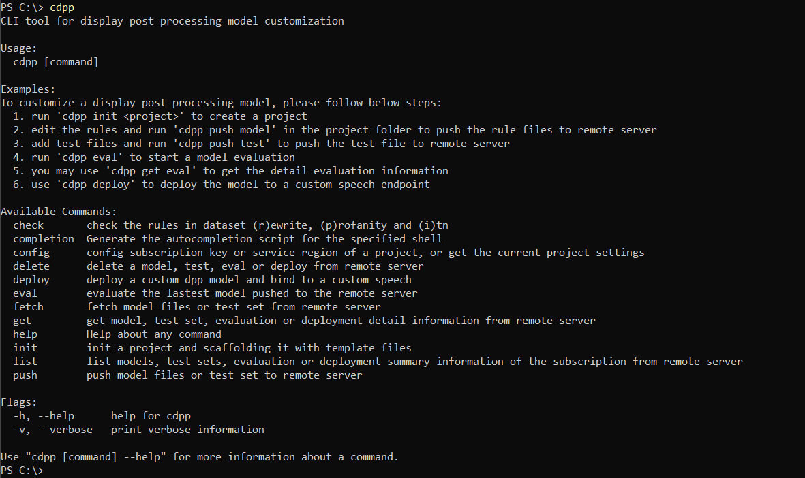

# Custom Display-Post-Processing Private Preview

## Overview

Automatic Speech Recognition output display format is critical to downstream tasks and one-size doesn’t fit all. Custom Display-Post-Processing (aka "Custom DPP") allows users to define their own lexical-to-display format rules to improve the speech recognition service quality on top of [Microsoft Azure Custom Speech Service](https://docs.microsoft.com/azure/cognitive-services/speech-service/custom-speech-overview).

## Features and capabilities

### Supported features
* Add **rewrite** rules to replace certain phrases from output with others, for capitalization, error correction, etc.;
* Add **profanity** rules to mask or remove certain words from output;
* Add advanced **invert-text-normalization** rules to format with certain display patterns

### Supported language and locales

:white_check_mark: en-US :white_check_mark: en-GB :white_check_mark: en-CA :white_check_mark: en-IN :white_check_mark: de-DE :white_check_mark: it-IT :white_check_mark: es-ES :white_check_mark: es-MX :white_check_mark: fr-CA :white_check_mark: fr-FR :white_check_mark: zh-CN :white_check_mark: ja-JP :white_check_mark: ko-KR :white_check_mark: nb-NO :white_check_mark: nl-NL (more locale supports are coming in the next versions).

[Learn more about Speech service supported languages and locales](https://docs.microsoft.com/azure/cognitive-services/speech-service/language-support)

### Supported service regions

:white_check_mark:  West US :white_check_mark:  East US :white_check_mark:  Central US :white_check_mark:  West Central US :white_check_mark:  North Europe :white_check_mark:  Central India

[Learn more about Speech service supported regions](https://docs.microsoft.com/azure/cognitive-services/speech-service/regions#speech-to-text-pronunciation-assessment-text-to-speech-and-translation)

## Prerequisites

* Set up your Azure account and Speech service account, and find your Speech service **key** and **region** (Learn more from [Try the Speech service for free](https://docs.microsoft.com/azure/cognitive-services/speech-service/overview#try-the-speech-service-for-free)).
* Set up your Custom Speech project and get the **custom model ID**. You can navigate to Speech Studio -> Custom Speech -> your custom speech project -> "Train custom models" tab -> click into one of your custom speech models, and copy the *Model ID* value from the card on the top (Learn more from [Custom Speech overview](https://docs.microsoft.com/azure/cognitive-services/speech-service/custom-speech-overview)).

## Get start with Custom DPP CLI

The Custom DPP command-line utility presents easy-to-use commands for display format customization.

* See the [Get Start](GETSTART.md) document about how to download and use the CLI tool to upload, evaluate, and deploy your custom display format models.
* See the [Concept](CONCEPTS.md) document about the basic concepts of Microsoft display post processing.

### Supported operations

The general format of Custom DPP CLI commands is: `cdpp [command] [arguments] --[flag-name] [flag-value]`

Available Commands:
* `init` - Create and init a project, scaffolding it with template files
* `push` - Push the custom model files or test set to Microsoft Speech server
* `eval` - Evaluate the latest model pushed to the Microsoft Speech server
* `deploy` - Deploy a custom DPP model and bind to a custom speech model
* `get` - Get model, test set, evaluation or deployment detail information from Microsoft Speech server
* `check` - Check the format/grammar of the custom rule dataset rewrite, profanity and ITN
* `config` - Config subscription key or service region of a project, or get the current project settings
* `delete` - Delete a model, test, eval or deploy from Microsoft Speech server
* `fetch` - Fetch model files or test set from Microsoft Speech server
* `list` - List models, test sets, evaluation or deployment summary information of the subscription from Microsoft Speech server
* `version` - Show version information and supported regions, locales
* `help` - Help about any command

### Find help from your command prompt

For convenience, consider adding the Custom DPP CLI location to your system path for ease of use. That way you can type `cdpp` from any directory on your system.

To see a list of commands, type `cdpp -h` and then press the ENTER key.

To learn about a specific command, just include the name of the command (For example: `cdpp push -h`).

If you choose not to add Custom DPP CLI to your path, you'll have to change directories to the location of your `cdpp` executable and type `cdpp` or `.\cdpp` in Windows PowerShell command prompts.

## Frequently asked questions

### How to obtain the default base DPP behaviors as a baseline?
You can push model with empty model files, edit and push your test cases, start evaluation, then download the evaluation logs to obtain the default base DPP outputs as a baseline to start. Refer to this [how-to doc](HOWTO.md#observe-the-default-behaviors-of-dpp-service) for more best-practices.

### Is unified speech-to-text service supported?
Not in private preview version. You have to specify a custom speech modelID (from [Custom Speech Service](https://docs.microsoft.com/azure/cognitive-services/speech-service/custom-speech-overview)) in order to enable Custom DPP builders. Unified Speech-to-text service without model customiztaion can only benefit from Microsoft built-in DPP base builders.

### Any size limits for the Custom DPP rules?
Yes. For private preview version, the maximum size is 1,000 lines of rules for *Rewrite* and *Profanity* file, and 200 lines of rules for *ITN* file.

### How long it will take to take effect on Speech service after deployming Custom DPP model?
After you deploy a Custom DPP model to online Speech Service (by typing `cdpp deploy`), you may wait for 1-3 hours before it takes effect to your custom model and endpoint, afterwards you can validate on the end-to-end audio to display output text process.

Also note that there are some service regions still being rolled out across Private Preview period, so please try again later if you encountered any deployment issues.

### Is Bring-Your-Own-Storage (BYOS) supported?
Not in private preview version. We are trying to support this in later versions. Learn more about Speech Service BYOS at [Speech service encryption of data at rest](https://docs.microsoft.com/azure/cognitive-services/speech-service/speech-encryption-of-data-at-rest). 

