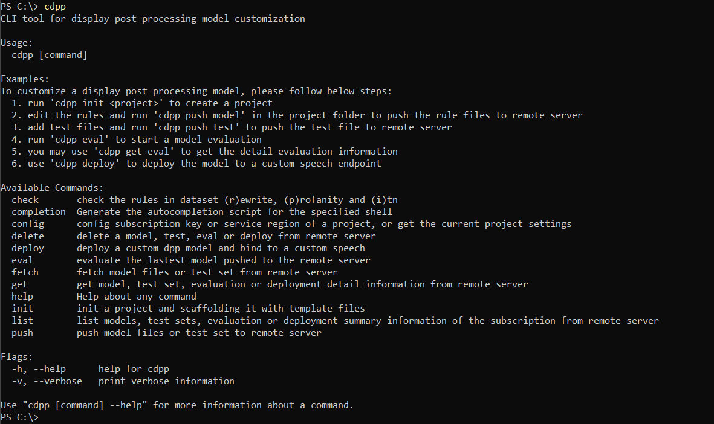

# Custom Display Post Processing CLI

## Overview

The Custom Display Post Processing (DPP) command-line utility presents easy-to-use commands for display format customization of Microsoft Speech service.

Supported on Windows, macOS and several Linux flavors.

## Features and capabilities

The Custom DPP CLI enable the customers to rewrite the display text output by Microsoft Speech service. Moreover, it provides the Invert Text Normalization (ITN) rules and profanity words customizations for many domain specific scenarios.

Supported locales:

:white_check_mark: en-us :white_check_mark: pt-br :white_check_mark: pt-pt :white_check_mark: it-it :white_check_mark: es-es 

:white_check_mark: es-mx :white_check_mark: fr-fr :white_check_mark: fr-ca :white_check_mark: zh-cn :white_check_mark: ja-jp 

Supported service region: 

:white_check_mark: West US :white_check_mark: West US2 :white_check_mark: East US :white_check_mark: East US2 :white_check_mark: Central US

:white_check_mark: Central India :white_check_mark: North Europe :white_check_mark: West Europe :white_check_mark: East Asia :white_check_mark: Japan East

## Download

The latest binary for Custom DPP CLI along with installation instructions may be found [here](GETSTART.md#download-custom-dpp-cli).

## Supported Operations

The general format of Custom DPP CLI commands is: `cdpp [command] [arguments] --[flag-name] [flag-value]`

Available Commands:
* `init` - Create and init a project, scaffolding it with template files
* `push` - Push the custom model files or test set to Microsoft Speech server
* `eval` - Evaluate the latest model pushed to the Microsoft Speech server
* `deploy` - Deploy a custom DPP model and bind to a custom speech model
* `get` - Get model, test set, evaluation or deployment detail information from Microsoft Speech server
* `check` - Check the format/grammar of the custom rule dataset rewrite, profanity and ITN
* `config` - Config subscription key or service region of a project, or get the current project settings
* `delete` - Delete a model, test, eval or deploy from Microsoft Speech server
* `fetch` - Fetch model files or test set from Microsoft Speech server
* `list` - List models, test sets, evaluation or deployment summary information of the subscription from Microsoft Speech server
* `version` - Show version information and supported regions, locales
* `help` - Help about any command

## Find help from your command prompt

For convenience, consider adding the Custom DPP CLI location to your system path for ease of use. That way you can type `cdpp` from any directory on your system.

To see a list of commands, type `cdpp -h` and then press the ENTER key.

To learn about a specific command, just include the name of the command (For example: `cdpp push -h`).

If you choose not to add Custom DPP CLI to your path, you'll have to change directories to the location of your `cdpp` executable and type `cdpp` or `.\cdpp` in Windows PowerShell command prompts.

## Get start with Custom DPP CLI

See the [Get Start](GETSTART.md) document about how to create use the CLI to upload, evaluate, and deploy your custom display format models.

See the [Concept](CONCEPTS.md) document about the basic concepts of Microsoft display post processing.

## Frequently asked questions

### How to observe the default behaviors of the DPP service?

See [How to](HOWTO.md) guide about the detail information.

### Do we support Bring Your Own Storage?

Not yet. We will add the bring your own storage in public preview.